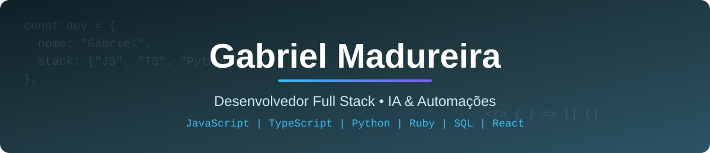

  

 

  
  
  

---

## 👨‍💻 Sobre mim

Olá! Eu sou o **Gabriel**, tenho **18 anos** e sou da **Bahia** 🌴.

Sou desenvolvedor apaixonado por transformar ideias em software de verdade. Tenho experiência no desenvolvimento de **SaaS**, do front-end ao back-end, e uso **IA no meu fluxo de programação** para entregar mais rápido e com mais qualidade.

- 💻 Desenvolvimento web **full stack** com JavaScript, TypeScript, React e Python
- 🤖 Programação assistida por IA e **engenharia de prompt**
- ⚙️ Automação de processos e integrações com **n8n**
- 🗄️ Modelagem e consultas em **SQL**
- 📚 Estudando todos os dias para escrever código cada vez melhor

---

## 🛠️ Stack

**Linguagens**

  
  
  
  
  
  
  

**Front-end e ferramentas**

  
  
  
  

---

## 🤖 IA & Automação

| Área | O que eu faço |
|------|---------------|
| **Programação com IA** | Uso assistentes de IA no dia a dia para desenvolver, depurar e revisar código |
| **Engenharia de prompt** | Escrevo prompts estruturados para obter resultados precisos e reproduzíveis |
| **Automações com n8n** | Crio fluxos que integram APIs, webhooks e serviços, eliminando tarefas repetitivas |
| **Desenvolvimento de SaaS** | Experiência construindo produtos SaaS completos |

---

## 🎯 Objetivos

- Evoluir como desenvolvedor full stack, escrevendo código limpo e bem estruturado
- Aprofundar o uso de IA e automação no desenvolvimento de software
- Construir projetos que resolvam problemas reais

---

## 📫 Contato

Aberto a conversas, colaborações e oportunidades na área de desenvolvimento.

  <a href="https://www.linkedin.com/in/gbieldev/">LinkedIn</a> •
  <a href="https://www.instagram.com/g.madureiras/">Instagram</a> •
  <a href="https://github.com/GbielDEV">GitHub</a>

Feito com 💙 por Gabriel Madureira

